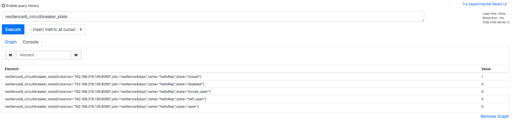
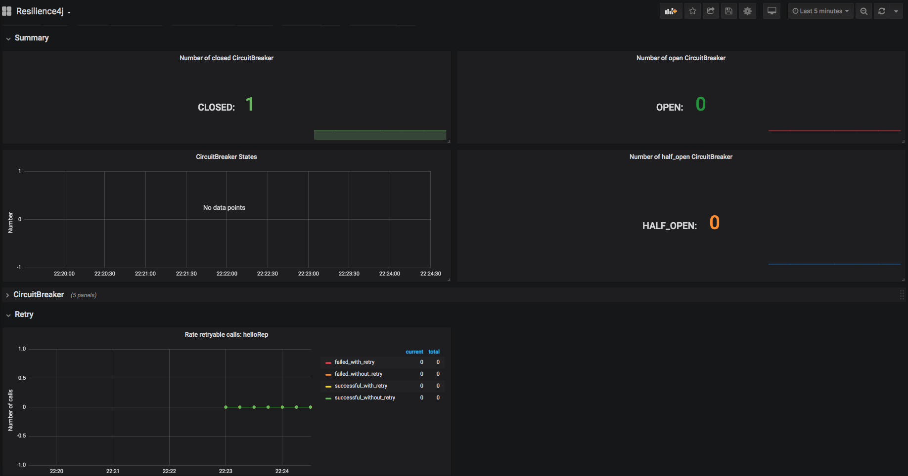

<p align="right">
    
    
</p>

# resilience4j-sample

## resilience4j w/ PROMETHEUS, GRAFANA

before start, have to install docker, docker-compose for grafana, prometheus
```
docker-compose -f docker-compose up 
```
## Application log
when success, no need to retry
```aidl
2019-12-15 22:54:01.847  INFO 12721 --- [           main] c.e.r.Resilience4jApplication            : Started Resilience4jApplication in 3.359 seconds (JVM running for 9.254)
2019-12-15 22:54:02.149  INFO 12721 --- [192.168.219.195] o.a.c.c.C.[Tomcat].[localhost].[/]       : Initializing Spring DispatcherServlet 'dispatcherServlet'
2019-12-15 22:54:02.149  INFO 12721 --- [192.168.219.195] o.s.web.servlet.DispatcherServlet        : Initializing Servlet 'dispatcherServlet'
2019-12-15 22:54:02.171  INFO 12721 --- [192.168.219.195] o.s.web.servlet.DispatcherServlet        : Completed initialization in 22 ms
2019-12-15 22:54:08.836  INFO 12721 --- [nio-8080-exec-3] c.e.resilience4j.external.HttpCaller     : Calling ExternalApi : success
```
when failed, do retry w/ exponential delay
```aidl
2019-12-15 22:55:28.477  INFO 12721 --- [nio-8080-exec-2] c.e.resilience4j.external.HttpCaller     : Calling ExternalApi : Fail
2019-12-15 22:55:29.515  INFO 12721 --- [nio-8080-exec-2] c.e.resilience4j.external.HttpCaller     : Calling ExternalApi : Fail
2019-12-15 22:55:31.515  INFO 12721 --- [nio-8080-exec-2] c.e.resilience4j.external.HttpCaller     : Calling ExternalApi : Fail
2019-12-15 22:55:31.527  INFO 12721 --- [nio-8080-exec-2] c.e.r.repository.HelloRepository         : Error occurs.. 

org.springframework.web.client.HttpServerErrorException: 500 INTERNAL_SERVER_ERROR
	at com.example.resilience4j.external.HttpCaller.callExternalApiWithAlwaysFail(HttpCaller.java:52) ~[main/:na]
	at io.github.resilience4j.retry.Retry.lambda$decorateSupplier$2(Retry.java:177) ~[resilience4j-retry-1.0.0.jar:1.0.0]
	at io.github.resilience4j.circuitbreaker.CircuitBreaker.lambda$decorateSupplier$4(CircuitBreaker.java:714) ~[resilience4j-circuitbreaker-1.0.0.jar:1.0.0]
	at io.vavr.control.Try.of(Try.java:75) ~[vavr-0.10.0.jar:na]
```
## Prometheus

## Grafana 

refer : https://github.com/resilience4j/resilience4j
